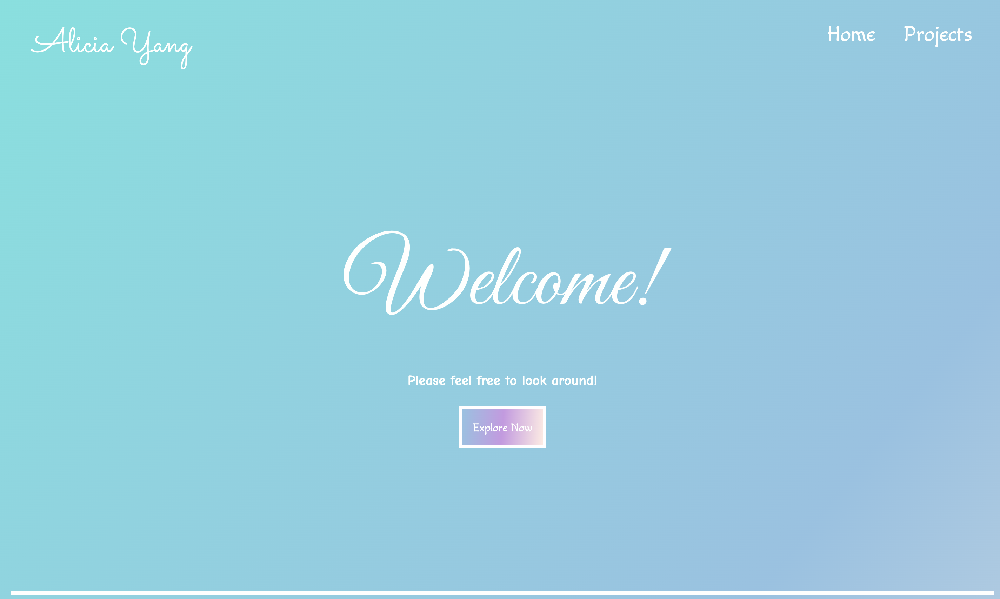
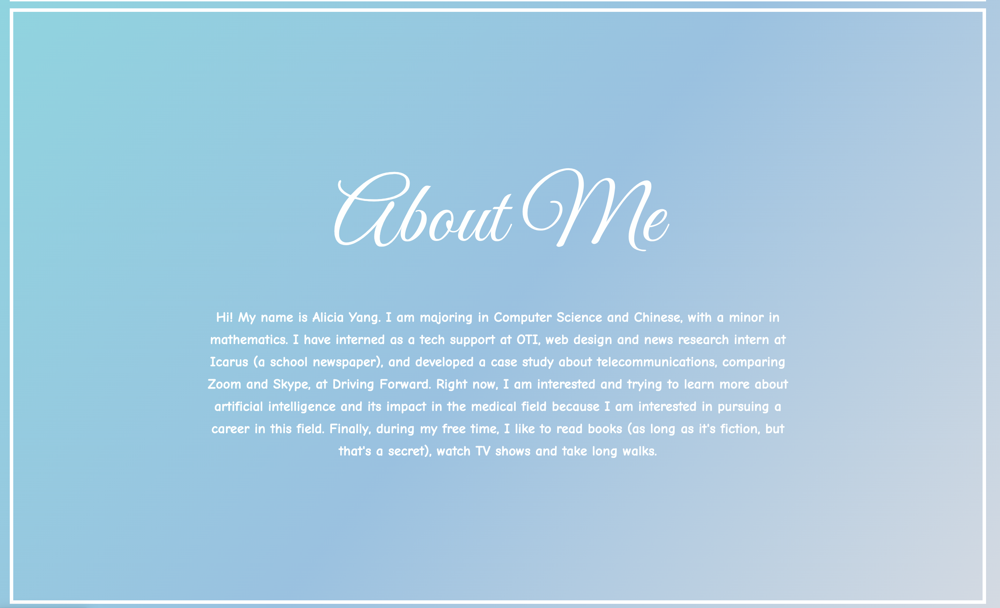
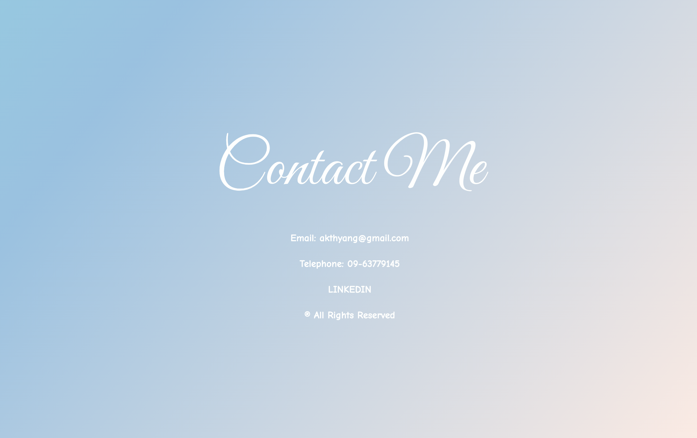
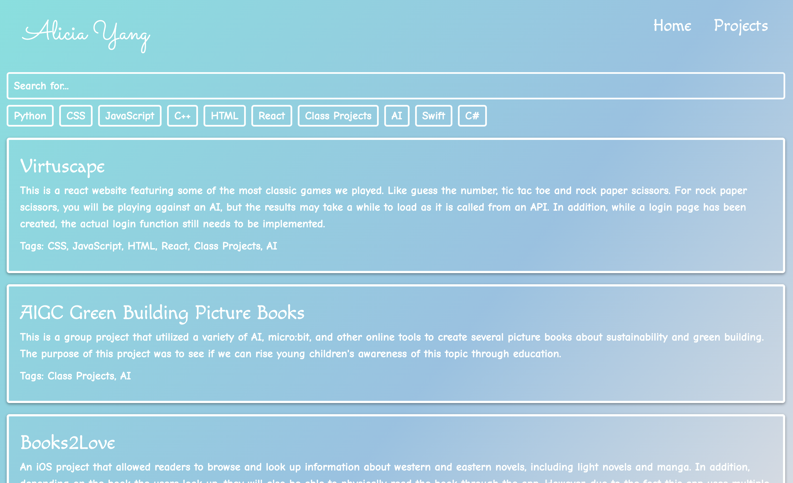
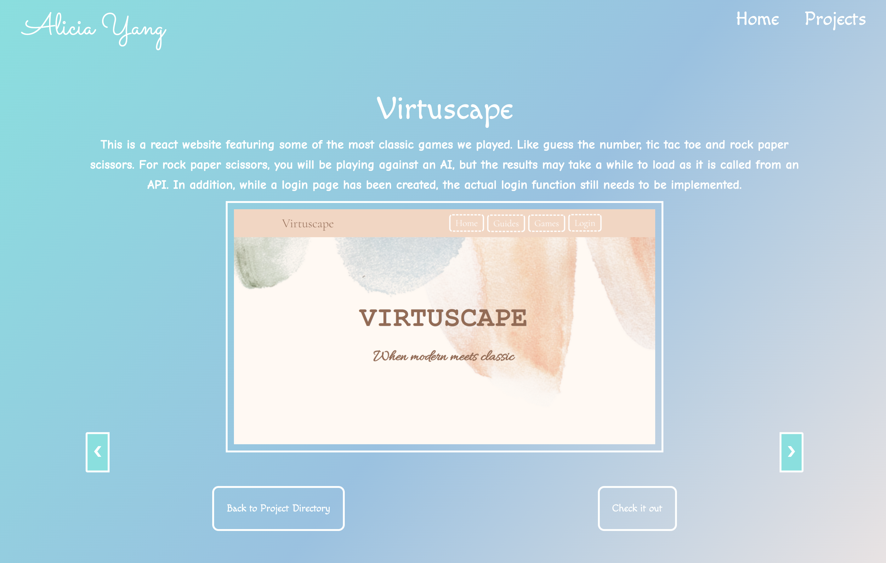

# Portfolio
A sample portfolio website created with Python and Django and deployed on Railway.
**Please note there are not a lot of projects available in this project and there is an error where media files are not loading when this app is deployed. I am already looking into this issue. Thank you.**

## Overview

### Home Page
The home page has 3 sections and traversing to each section will trigger a small animation, but the animation itself may a take a few seconds to load.

### Project Directory
Here you can see all the coding projects I uploaded to the website. You can also filter and look for certain projects using the search bar or the tags.

### Project Info
Below shows the template of each project's info page. If the project has multiple images, the pictures are displayed in a carousel.

